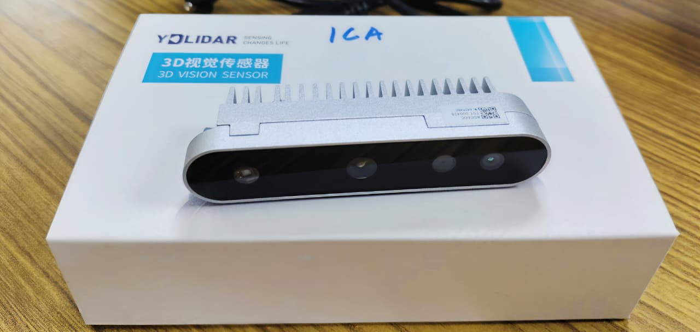
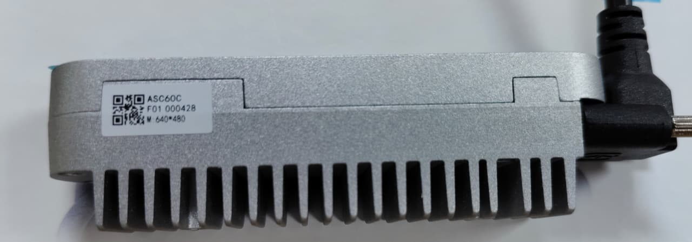

# YDLIDAR ICA ASC60C



> **Community setup and development guide for the YDLIDAR ICA ASC60C 3D depth camera.**

---

## 📌 A note on naming

| Physical label | Software identity |
|---------------|------------------|
| **ICA ASC60C** | **YDLIDAR HP60C** (model type 9) |

The device is labelled **"ICA ASC60C"** on its casing. However, all official software — the
EAIViewer GUI, the `ascamera.exe` command‑line tool, and the `EaiCameraSdk` — recognise it
as the **YDLIDAR HP60C**.

The two names refer to the **same 3D depth camera**.  
Throughout this guide we use **HP60C** whenever we talk about software, drivers, or tool
behaviour, and **ICA ASC60C** only when referring to the physical unit.

Official product page: [YDLIDAR HP60C](https://www.ydlidar.com/product/ydlidar-hp60c)

---

## 📷 Camera Specifications

| Parameter | Value |
|-----------|-------|
| **Model** | ICA ASC60C (detected as HP60C / model type 9) |
| **Technology** | Structured‑light 3D imaging |
| **Depth Resolution** | 640 × 480 @ 20 fps |
| **RGB Resolution** | 640 × 480 @ 20 fps (hardware supports up to 1920 × 1080) |
| **Range** | 0.2 – 4 m (optimal within 2 m) |
| **FOV** | 73.8° (H) × 58.8° (V) × 86.4° (D) |
| **RGB Format** | RGB888 (921 600 bytes per frame) |
| **Depth Format** | 16‑bit RAW (614 400 bytes per frame) |
| **Interface** | USB 2.0 (Type‑C), UVC protocol |
| **Power** | < 2 W |
| **Dimensions** | 89.8 × 19.0 × 25.0 mm |



---

## 📚 Documentation

Official PDFs shipped with the camera are available in the `docs/` folder:

| Document | File |
|----------|------|
| Data Sheet | [YDLIDAR HP60C Data Sheet.pdf](docs/YDLIDAR%20HP60C%20Data%20Sheet.pdf) |
| User Manual | [YDLDIAR HP60C User Manual.pdf](docs/YDLDIAR%20HP60C%20User%20Manual.pdf) |

They contain detailed technical parameters, mechanical drawings, and operating instructions
directly from the manufacturer.

---

## ⚙️ Prerequisites

All tools run on **Windows 10/11** only (the official SDK and viewer are not cross‑platform).

| Tool | Version | Why you need it | Download |
|------|---------|----------------|----------|
| **Visual Studio Build Tools** | 2022 (17.x) | Compiles the C++ SDK (`ascamera.exe`) | [aka.ms/vs/17/release/vs_BuildTools.exe](https://aka.ms/vs/17/release/vs_BuildTools.exe) — select **"Desktop development with C++"** |
| **CMake** | 3.5+ | Generates the Visual Studio project from `CMakeLists.txt` | [cmake.org/download](https://cmake.org/download) — check **"Add CMake to the system PATH"** |
| **Python** | 3.8+ | Runs the Python Frame Capture script | [python.org](https://python.org) |
| **OpenCV (Python)** | 3.4+ | Display windows, image handling | `pip install opencv-python numpy` |
| **pywin32 (Python)** | latest | Captures the live RGB window pixel‑perfect | `pip install pywin32` |

No special USB driver is required — the camera enumerates as a standard UVC device and appears in Device Manager automatically.

---

## 📁 Repository Structure
```
YDLIDAR-ICA-ASC60C/
├── docs/
├── HP60CClientViewer/
├── EaiCameraSdk/
│ ├── src/
│ ├── build/
│ ├── configurationfiles/
│ ├── dlls/
│ ├── include/
│ ├── libs/
│ └── CMakeLists.txt
├── Python/
├── Output/
│ ├── RGB/
│ ├── Depth/
│ ├── PointCloud/
│ └── Livefeed/
├── images/
├── .gitignore
├── LICENSE
└── README.md
```


---

## 🖥️ Method 1 — HP60CClientViewer (GUI Tool)

The **HP60CClientViewer** (also called *EAIViewer*) is the official YDLIDAR GUI for
3D depth cameras. No compilation necessary.
### Setup

Clone this repository:
```powershell
git clone https://github.com/KathirVelan11/YDLIDAR-ICA-ASC60C.git
cd YDLIDAR-ICA-ASC60C
```
### How to run

```powershell
cd HP60CClientViewer
.\EAIViewer.exe
```
### Interface Overview

The viewer displays three synchronized streams:


- **RGB Window** — Live colour feed
- **Depth Window** — Colour-mapped depth map (JET colormap)
- **Point Cloud** — Interactive 3D viewer

### Saving Frames

#### Method 1: Single Snapshot
Click the **Snapshot button** (camera icon in the toolbar) to save a single frame set.

By default, frames are saved to:
```
HP60CClientViewer\Nuwa-HP60C\Snap\rgb\       (2D RGB frame)
HP60CClientViewer\Nuwa-HP60C\Snap\depth\     (2D Depth frame)
```

When you toggle to 3D view, you can also save:
```
HP60CClientViewer\Nuwa-HP60C\Snap\pointcloud\  (3D Point Cloud)
```

#### Method 2: Batch Capture (Data Management)
Use the **Data Management** panel (sidebar) to batch-capture multiple streams:

1. Select an output folder (will use `Output/` directory in this repo by default)
2. Choose the number of frames or a time duration
3. Tick the boxes for the streams you want to save:
   - RGB (2D)
   - Depth (2D)
   - Point Cloud (3D)
   - All three

The viewer saves the selected data to sub-folders (`rgb/`, `depth/`, `pointcloud/`) inside your chosen output directory (e.g., `Output/rgb/`, `Output/depth/`, `Output/pointcloud/`).

---

## 🔧 Method 2 — EaiCameraSdk (C++ Command-Line Tool)

The official C++ SDK builds a command-line tool (`ascamera.exe`) that streams the camera
and saves snapshots on key press. This is the primary tool for custom dataset creation.

### Setup

Clone this repository (if you haven't already):
```powershell
git clone https://github.com/KathirVelan11/YDLIDAR-ICA-ASC60C.git
cd YDLIDAR-ICA-ASC60C
```

### One-Time Build

```powershell
cd EaiCameraSdk
mkdir build
cd build
cmake .. -G "Visual Studio 17 2022" -A x64
cmake --build . --config Release
```

### Run

```powershell
cd EaiCameraSdk\build
.\Release\ascamera.exe
```


### Keyboard Controls

| Key | Action |
|-----|--------|
| **s** | Save one snapshot (RGB + Depth + PointCloud) |
| **d** | Toggle live display on / off |
| **q** | Quit |

### Output Paths

| Stream | Folder |
|--------|--------|
| RGB | `Output/RGB/rgb_*.png` |
| Depth (colour-mapped) | `Output/Depth/depth_*.png` |
| Point Cloud | `Output/PointCloud/*_PointCloud_*.pcd` |

### Modifying Output Paths

To change where frames are saved:

1. Open `EaiCameraSdk/src/Camera.cpp`
2. Locate the `saveImage()` function
3. Edit the `std::string` variables that define output paths

Example:
```cpp
std::string rgbPath = "Output/RGB/rgb_" + std::to_string(index) + ".png";
std::string depthPath = "Output/Depth/depth_" + std::to_string(index) + ".png";
std::string pclPath = "Output/PointCloud/" + std::to_string(index) + "_PointCloud.pcd";
```

Rebuild after editing:
```powershell
cd EaiCameraSdk\build
cmake --build . --config Release
```

---

## Python Frame Capture for Dataset Creation

While `ascamera.exe` is running, you can automatically capture the live RGB window
at a steady frame rate using the included Python script.
This produces a clean sequence of frames ready for training or analysis.

### How It Works

The Python Frame Capture script (`Python/grab_frames.py`) uses `win32gui` to grab the OpenCV window pixels directly.
What you see in the live window is exactly what gets saved — no re-encoding or quality loss.

### Usage

1. Start `ascamera.exe` (see Method 2) — **keep the RGB window visible**
2. Open a second terminal and run:

```powershell
cd Python
python grab_frames.py
```

The script runs continuously until you press `Ctrl + C` or close the terminal.

### Configuration

Edit these variables in `grab_frames.py`:

| Variable | Default | Description |
|----------|---------|-------------|
| `self.target_fps` | 20 | Frames per second. 20 fps is the hardware-confirmed maximum. Set lower (e.g., 10) if needed; 30 is not possible. |
| `save_dir` (inside `start()`) | `Output/Livefeed/` | Where the images are saved |

### Output

```
Output/Livefeed/frame_000001.png
Output/Livefeed/frame_000002.png
…
```

This pipeline is the foundation for building custom RGB-D datasets, object detection training sets,
or any scenario that requires synchronised, timestamped captures.

---

## Known Limitation: 640 × 480 Resolution Lock

Despite the datasheet stating a maximum RGB resolution of 1920 × 1080, the camera
always streams at 640 × 480. This is true in EAIViewer, `ascamera.exe`, and the Python Frame Capture script.

Below is a summary of attempted unlocking methods. Contributions are welcome — if you manage
to break the lock, please open an issue or pull request!

### What Controls the Resolution

Four layers must agree before a stream starts:

1. **User code** (Demo.cpp) — sets desired width/height via the SDK
2. **AngstrongCameraSdk.dll** — validates against an internal table, reads the encrypted config file, communicates with firmware
3. **Camera firmware** — implements the UVC descriptor table and drives the sensor
4. **Config file** — `hp60c_v2_00_20230704_configEncrypt.json`; holds exposure, gain, and depth parameters

### Attempts Made

| Attempt | Action | Result |
|---------|--------|--------|
| 1 | Modified Demo.cpp to request 1920×1080 | SDK rejects with "Not support width, height or FPS" — its own internal list forbids it |
| 2 | Decrypted the config file (AES-256-CBC, key extracted from DLL) | Plaintext contains only depth-related and calibration parameters; no resolution fields |
| 3 | Hex-patched the SDK DLL, replacing every occurrence of 640×480 with 1920×1080, NOP'd rejection jumps | SDK accepts new values and starts stream, but firmware returns "not supported image size" |
| 4 | Queried the UVC firmware directly via OpenCV (without SDK) | Camera supports 1280×720, but only with proprietary pixel format OpenCV cannot decode — SDK is needed |
| 5 | Patched DLL for 1280×720 and set Demo.cpp accordingly | Stream starts, but Windows kernel UVC driver selects 640×480 (default entry) before user-mode code intervenes |
| 6 | Built runtime hook DLL (resolution_hook.dll) to overwrite constants after SDK loads | Hook fires and patches memory, but kernel negotiates 640×480 during device initialisation — too early for user-mode hooks |
| 7 | (Theoretical) Patch usbvideo.sys — Windows kernel UVC driver | Possible in principle, but driver is protected by Secure Boot and Driver Signature Enforcement; also makes system fragile |

### What We Learned

- The encryption on the config file is not the bottleneck — it holds no resolution parameters
- The firmware's UVC descriptor lists 1280×720, but the first entry is always 640×480
- The Windows kernel UVC driver picks the default (640×480) before the SDK can select an alternative
- Any solution must either:
  - Modify the firmware (requires manufacturer tools), or
  - Patch the Windows kernel driver before enumeration (risky, not practical)

### How You Can Help

If you have experience with:
- USB video device firmware
- UVC driver development
- Reverse engineering of Windows kernel streaming

We'd love to collaborate! The camera is capable of more — we just need a way to tell the driver
to pick 1280×720 instead of 640×480.

---

## 📡 Official Source

All software and SDK files in this repository were obtained from the official YDLIDAR downloads page:

https://www.ydlidar.cn/download/category/tool-sdk-ros-lidarclient

They are organised and documented here for convenience and community usage.

---

## 🙏 Acknowledgements

- **Shenzhen EAI Technology Co., Ltd.** (ydlidar.com) — for the hardware, SDK, and EAIViewer software
- **Angstrong Tech** — for the underlying AngstrongCameraSdk
- **The open-source community** — for CMake, OpenCV, and Qt
