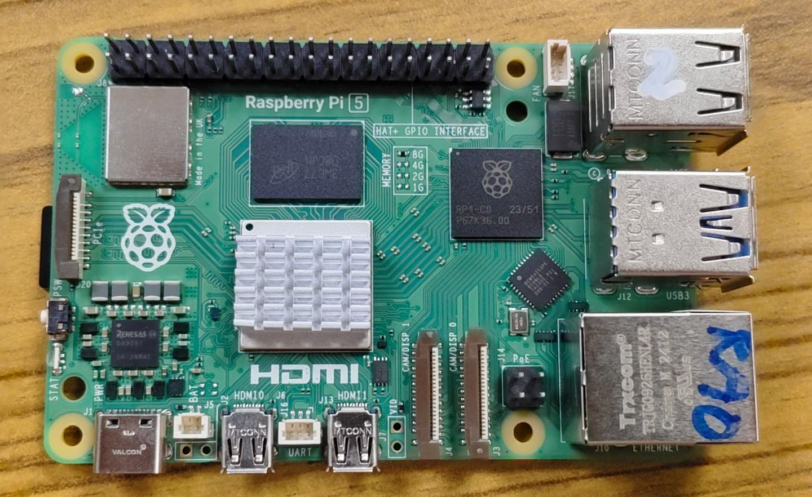

# Ubuntu 24.04 Headless — YDLIDAR ICA ASC60C Setup

> **Raspberry Pi 5 + YDLIDAR HP60C 3D Depth Camera**

## Hardware Used

- **Raspberry Pi 5** (8GB RAM)
- **32GB microSD card**
- **YDLIDAR ICA ASC60C** depth camera (detected as HP60C, model type 9)



---

## Step 1 — Flash the OS

Use **Raspberry Pi Imager** on Windows.

- **Device:** Raspberry Pi 5
- **OS:** Ubuntu Server 24.04 LTS (64-bit)

> ⚠️ **Recommendation: Ubuntu Server 22.04 LTS instead**
>
> We used 24.04 and **successfully captured all RGB data** (depth and point cloud conversion also work).  
> However, the live GUI display (press `d` in the camera tool) does **not work on 24.04** due to broken C++ development packages in the ARM64 repository.
>
> If you need the live OpenCV preview window during capture, flash **22.04 LTS instead** — everything else works identically. RGB-only capture works perfectly on 24.04.

---

## Step 2 — First Login

Insert microSD card into Pi 5, connect power and Ethernet (or Wi-Fi).

Find the Pi's IP address:
```bash
hostname -I
```

From Windows PowerShell, SSH in:
```powershell
ssh mamba@<pi-ip>
```

(Replace `<pi-ip>` with the actual IP address from above.)

---

## Step 3 — Install Dependencies

```bash
sudo apt update
sudo apt install -y cmake g++ git make python3 python3-pip python3-venv python3-opencv python3-numpy
```

---

## Step 4 — Create Python Virtual Environment

```bash
python3 -m venv ~/vision_env
source ~/vision_env/bin/activate
```

---

## Step 5 — Clone the Repository and Setup

```bash
cd ~
git clone https://github.com/KathirVelan11/YDLIDAR-ICA-ASC60C.git
cd YDLIDAR-ICA-ASC60C/Ubuntu-24.04-Headless
chmod +x unpack_linux_ros.sh
./unpack_linux_ros.sh
```

The script unpacks the Linux ROS package. Then build:

```bash
cd linux_ros/linux
sudo ./build.sh
```

This compiles the C++ camera SDK for ARM64. Takes 2–3 minutes on Pi 5.

---

## Step 6 — Run the Camera

Open **two separate SSH terminals** to the Pi.

### Terminal 1 — Start Camera SDK

```bash
cd ~/YDLIDAR-ICA-ASC60C/Ubuntu-24.04-Headless/linux_ros/linux
sudo ./run_ascamera.sh
```

The tool starts and prints:
```
Camera stream running...
Press 's' to save snapshot (RGB + Depth + PointCloud)
Press 'q' to quit
```

Press `s` to save a frame set (RGB, depth map, and point cloud).

### Terminal 2 — Auto-Convert Frames to JPEG

While Terminal 1 is running, activate your environment and start the converter:

```bash
source ~/vision_env/bin/activate
cd ~/YDLIDAR-ICA-ASC60C/Ubuntu-24.04-Headless
python3 convert_frames.py
```

This script **watches the build folder in real time**. Every time you press `s` in Terminal 1, a raw `.yuv` file appears and is instantly converted to `.jpg` in the `output/` folder.

---

## Understanding convert_frames.py

The Python script performs frame conversion automatically:

1. **Detects new `.yuv` files** in the build directory
2. **Reads raw BGR bytes** from the YUV file
3. **Reshapes into proper image** (640 × 480 × 3 pixels)
4. **Converts BGR → RGB** and saves as JPEG
5. **Runs continuously** — no manual intervention needed

### Output

```
output/frame_1.jpg
output/frame_2.jpg
output/frame_3.jpg
…
```

---

## Step 7 — Transfer Files to Windows

Use any method:

### Option A: WinSCP (Drag & Drop GUI)
Download [WinSCP](https://winscp.net/) and drag files from Pi to Windows.

### Option B: SCP from PowerShell
```powershell
scp -r mamba@<pi-ip>:~/YDLIDAR-ICA-ASC60C/Ubuntu-24.04-Headless/output C:\Users\ok\Desktop\
```

### Option C: Physical microSD Card
Remove the card from Pi and read it directly on Windows.

---

## ⚠️ Known Issues

### Live GUI on Ubuntu 24.04

If you press `d` while the camera is running on 24.04, you'll see:
```
Warning: Please install opencv and recompilation
```

This is because `libopencv-dev` fails to install correctly on ARM64 in the 24.04 repository.

**Workaround:**
- Continue without live preview — press `s` to save frames, they convert instantly in Terminal 2
- Or flash Ubuntu 22.04 LTS instead

### RGB-Only Data

During our testing, we collected **RGB frames only**. Depth maps and point clouds are extracted from the raw data by the SDK, but the primary output is the RGB `.jpg` files.

---

## 📁 Output Structure

After capturing and converting:

```
Ubuntu-24.04-Headless/
├── output/
│   ├── frame_1.jpg
│   ├── frame_2.jpg
│   └── …
├── convert_frames.py
└── README.md
```

---

## 🎯 Next Steps

1. Transfer the `.jpg` files to Windows using one of the methods above
2. Use these frames for dataset creation, analysis, or training
3. Refer to the [Main README](../README.md) for general camera specifications and the known resolution limitation

---

## 📚 Documentation

Official YDLIDAR documentation is in `docs/`:
- [YDLIDAR HP60C Data Sheet](../docs/YDLIDAR%20HP60C%20Data%20Sheet.pdf)
- [YDLIDAR HP60C User Manual](../docs/YDLDIAR%20HP60C%20User%20Manual.pdf)
- [YDLIDAR HP60C SDK & ROS Manual](../docs/YDLIAR%20HP60C%20SDK%20ROS%20DEVELOPMENT%20AND%20USE%20MANUAL.pdf)
- [YDLIDAR HP60C SDK](../docs/YDLIDAR%20HP60C-SDK.pdf)

---

## 🙏 Acknowledgements

- **Shenzhen EAI Technology Co., Ltd.** (ydlidar.com) — camera hardware & SDK
- **Angstrong Tech** — AngstrongCameraSdk
- **Raspberry Pi Foundation** — RPi 5 platform
- **The open-source community** — CMake, OpenCV, Python
