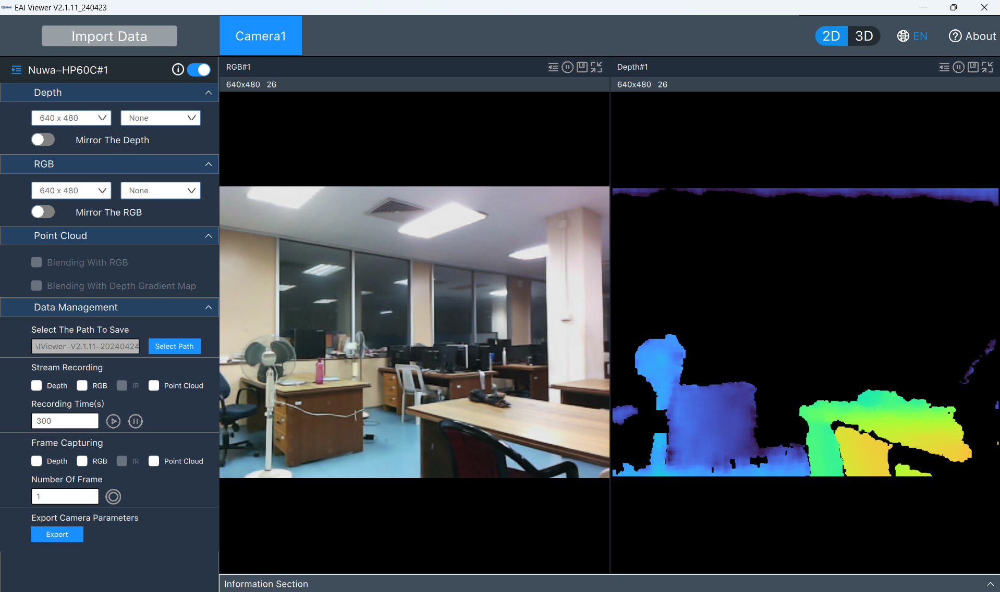
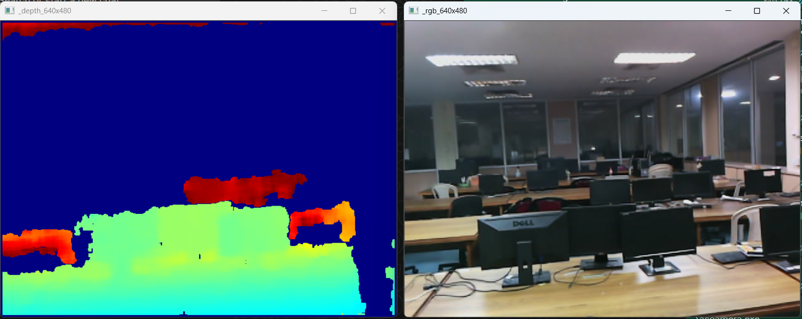

# Windows 11 — YDLIDAR ICA ASC60C Setup

> **Windows 11 + YDLIDAR HP60C 3D Depth Camera**

This guide covers two methods to capture RGB, depth, and point cloud data on Windows 11:
1. **HP60CClientViewer** — Official GUI (no compilation required)
2. **EaiCameraSdk** — C++ command-line tool (build from source)

---

## Prerequisites

All tools run on **Windows 10/11** only. The official SDK and viewer are Windows-only.

| Tool | Version | Why | Download |
|------|---------|-----|----------|
| **Visual Studio Build Tools** | 2022 (17.x) | Compiles the C++ SDK (`ascamera.exe`) | [aka.ms/vs/17/release/vs_BuildTools.exe](https://aka.ms/vs/17/release/vs_BuildTools.exe) — select **"Desktop development with C++"** |
| **CMake** | 3.5+ | Generates Visual Studio projects | [cmake.org/download](https://cmake.org/download) — check **"Add CMake to the system PATH"** |
| **Python** | 3.8+ | Frame capture script (optional) | [python.org](https://python.org) |
| **OpenCV (Python)** | 3.4+ | Image handling | `pip install opencv-python numpy` |
| **pywin32 (Python)** | latest | Window capture (optional) | `pip install pywin32` |

**USB Driver:** No special driver needed — the camera enumerates as a standard UVC device in Device Manager.

---

## Clone the Repository

```powershell
git clone https://github.com/KathirVelan11/YDLIDAR-ICA-ASC60C.git
cd YDLIDAR-ICA-ASC60C
```

---

## Method 1 — HP60CClientViewer (GUI Tool)

The **HP60CClientViewer** (also called *EAIViewer*) is the official YDLIDAR GUI. **No compilation required.**

### Run

```powershell
cd Windows-11\HP60CClientViewer
.\AngstrongViewer.exe
```

### Interface Overview

Three synchronized streams display:



- **RGB Window** — Live colour feed
- **Depth Window** — Colour-mapped depth map (JET colormap)
- **Point Cloud** — Interactive 3D viewer

### Saving Frames

#### Single Snapshot
Click the **Snapshot button** (camera icon in toolbar) to save one frame set.

Frames save to:
```
HP60CClientViewer\Nuwa-HP60C\Snap\rgb\       (RGB frame)
HP60CClientViewer\Nuwa-HP60C\Snap\depth\     (Depth map)
HP60CClientViewer\Nuwa-HP60C\Snap\pointcloud\ (Point Cloud)
```

#### Batch Capture (Data Management)
Use the **Data Management** panel (sidebar) to batch-capture multiple frame sets:

1. Select output folder (default: `Output/`)
2. Choose number of frames or duration
3. Tick streams to capture:
   - RGB (2D)
   - Depth (2D)
   - Point Cloud (3D)

Frames save to: `Output/rgb/`, `Output/depth/`, `Output/pointcloud/`

---

## Method 2 — EaiCameraSdk (C++ Command-Line Tool)

Build and run the C++ SDK to get a command-line tool (`ascamera.exe`) for custom frame capture.

### One-Time Build

```powershell
cd Windows-11\EaiCameraSdk
mkdir build
cd build
cmake .. -G "Visual Studio 17 2022" -A x64
cmake --build . --config Release
```

### Run

```powershell
cd Windows-11\EaiCameraSdk\build
.\Release\ascamera.exe
```



### Keyboard Controls

| Key | Action |
|-----|--------|
| **s** | Save one snapshot (RGB + Depth + PointCloud) |
| **d** | Toggle live display on/off |
| **q** | Quit |

### Output Paths

| Stream | Default Path |
|--------|--------------|
| RGB | `Output/RGB/rgb_*.png` |
| Depth | `Output/Depth/depth_*.png` |
| Point Cloud | `Output/PointCloud/*_PointCloud_*.pcd` |

### Customizing Output Paths

To change where frames are saved:

1. Open `EaiCameraSdk/src/Camera.cpp`
2. Find the `saveImage()` function
3. Edit the path variables:

```cpp
std::string rgbPath = "Output/RGB/rgb_" + std::to_string(index) + ".png";
std::string depthPath = "Output/Depth/depth_" + std::to_string(index) + ".png";
std::string pclPath = "Output/PointCloud/" + std::to_string(index) + "_PointCloud.pcd";
```

Rebuild after editing:
```powershell
cd Windows-11\EaiCameraSdk\build
cmake --build . --config Release
```

---

## Python Frame Capture

While `ascamera.exe` is running, automatically capture the live RGB window at steady frame rate.

### How It Works

The Python script (`Windows-11/grab_frames.py`) captures the OpenCV window pixels directly using `win32gui`. What you see in the window is exactly what gets saved — no re-encoding or quality loss.

### Usage

1. Start `ascamera.exe` (see Method 2 above) — **keep the RGB window visible**
2. Open a second terminal:

```powershell
cd Windows-11
python grab_frames.py
```

The script runs continuously until you press `Ctrl + C`.

### Configuration

Edit these variables in `grab_frames.py`:

| Variable | Default | Description |
|----------|---------|-------------|
| `self.target_fps` | 20 | Frames per second (hardware max is 20 fps) |
| `save_dir` | `Output/Livefeed/` | Where images are saved |

### Output

```
Output/Livefeed/frame_000001.png
Output/Livefeed/frame_000002.png
…
```

---

## Known Limitation: 640 × 480 Resolution Lock

Despite the datasheet claiming a maximum RGB resolution of 1920 × 1080, the camera always streams at 640 × 480 on Windows 11. This is a **firmware-level limitation**, not a software bug.

### What Controls the Resolution

Four layers must agree:

1. **User code** (Demo.cpp) — requests width/height via SDK
2. **AngstrongCameraSdk.dll** — validates against internal table and firmware config
3. **Camera firmware** — implements UVC descriptor and sensor control
4. **Config file** — `hp60c_v2_00_20230704_configEncrypt.json` (encrypted)

### Attempts Made on Windows

| Attempt | Action | Result |
|---------|--------|--------|
| 1 | Modified Demo.cpp to request 1920×1080 | SDK rejects: "Not support width, height or FPS" |
| 2 | Decrypted config file (AES-256-CBC) | Contains only depth/calibration params; no resolution fields |
| 3 | Hex-patched SDK DLL (640×480 → 1920×1080) | SDK accepts, but firmware returns "image size not supported" |
| 4 | Queried UVC firmware directly via OpenCV (no SDK) | Camera supports 1280×720, but with proprietary pixel format |
| 5 | Patched DLL for 1280×720 in Demo.cpp | Stream starts, but Windows kernel driver selects 640×480 (default) |
| 6 | Built runtime hook DLL to patch memory | Kernel negotiates 640×480 during init — too early for hooks |
| 7 | (Theoretical) Patch usbvideo.sys kernel driver | Protected by Secure Boot & Driver Signature Enforcement |

### What We Learned

- The config file is encrypted but holds no resolution fields
- The firmware's UVC descriptor lists 1280×720, but defaults to 640×480
- The Windows kernel UVC driver picks the default before user-mode code intervenes
- Any real solution requires firmware modification (manufacturer tools only)

### How You Can Help

If you have experience with USB video device firmware, UVC driver development, or reverse engineering, we'd love to collaborate! Open an issue or pull request.

---

## 📁 Output Structure

After capturing:

```
Windows-11/
├── Output/
│   ├── RGB/
│   │   ├── rgb_0.png
│   │   ├── rgb_1.png
│   │   └── …
│   ├── Depth/
│   │   ├── depth_0.png
│   │   └── …
│   ├── PointCloud/
│   │   ├── 0_PointCloud_*.pcd
│   │   └── …
│   └── Livefeed/
│       ├── frame_000001.png
│       └── …
├── EaiCameraSdk/
├── HP60CClientViewer/
└── grab_frames.py
```

---

## 🎯 Choosing a Method

| Scenario | Recommended | Why |
|----------|-----------|-----|
| Quick preview, single snapshots | **HP60CClientViewer** | No build required, intuitive UI |
| Automated dataset capture | **ascamera.exe** | Keyboard control, batch saves, customizable paths |
| Continuous livestream capture | **Python script** | Steady frame rate, scriptable |
| Research/development | **EaiCameraSdk** | Full source code, modify as needed |

---

## Troubleshooting

### Camera not detected
- Check USB connection (USB 2.0 Type-C)
- Open Device Manager and look for "YDLIDAR" or "Angstrong" devices
- Try a different USB port

### Build fails
```powershell
cd EaiCameraSdk\build
cmake --clean .
cmake .. -G "Visual Studio 17 2022" -A x64
cmake --build . --config Release
```

### Live display broken (`d` key)
- Ensure OpenCV is installed: `pip install opencv-python`
- May be a display driver issue on some systems

### Python script can't find window
- Ensure `ascamera.exe` is running and the RGB window is visible
- Check window title in the script (should match OpenCV window name)

---

## 📚 Documentation

Official YDLIDAR documentation is in `docs/`:
- [YDLIDAR HP60C Data Sheet](../docs/YDLIDAR%20HP60C%20Data%20Sheet.pdf)
- [YDLIDAR HP60C User Manual](../docs/YDLDIAR%20HP60C%20User%20Manual.pdf)
- [YDLIDAR HP60C SDK & ROS Manual](../docs/YDLIAR%20HP60C%20SDK%20ROS%20DEVELOPMENT%20AND%20USE%20MANUAL.pdf)
- [YDLIDAR HP60C SDK](../docs/YDLIDAR%20HP60C-SDK.pdf)

---

## 🙏 Acknowledgements

- **Shenzhen EAI Technology Co., Ltd.** (ydlidar.com) — camera hardware & SDK
- **Angstrong Tech** — AngstrongCameraSdk
- **Microsoft** — Visual Studio Build Tools, Windows UVC drivers
- **The open-source community** — CMake, OpenCV, Qt
